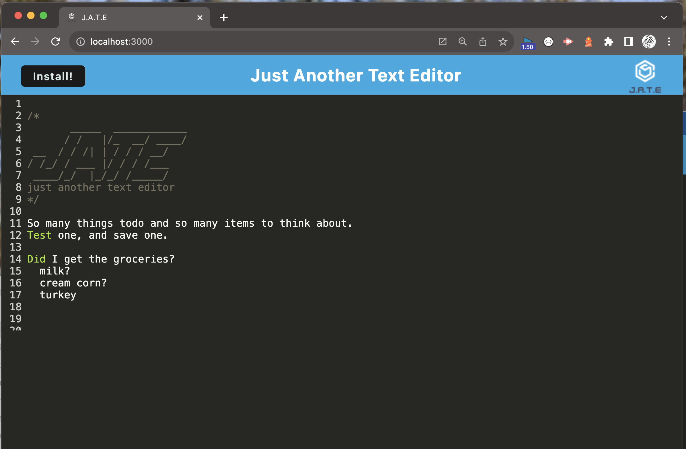
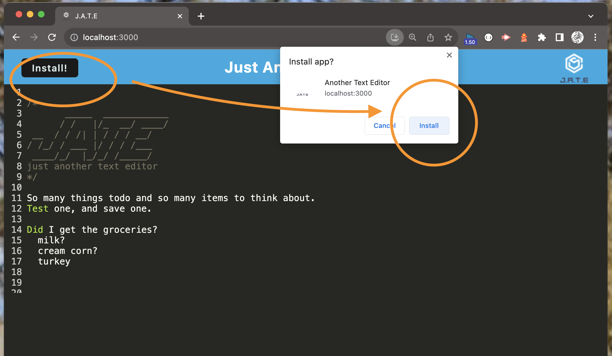
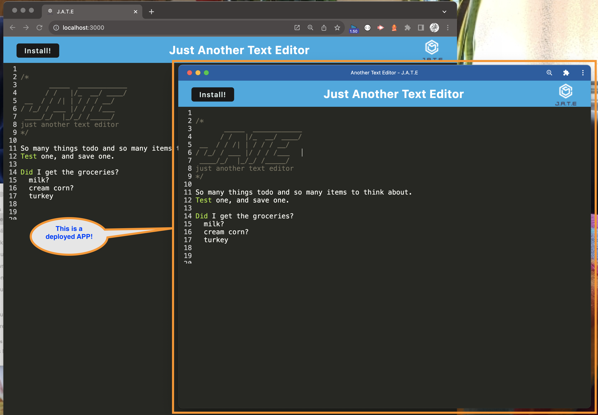

# ATE
(Just) Another Text Editor that allows for creating and updating text data and store it locally

## Description

This application allows the user to create, edit, change and delete data on the fly using their browser, or installing it locally as a PWA (Progressive Web Application). It is a very lightweight application and can now be used on and off internet. Simply build it, start it and then install it using your browser and now you will have a functioning PWA you can use to take notes, write a paper, or whatever you want. 

Some specific technologies this text editor application uses are: webpack, HMR (Hot Module Replacement), IndexedDB and Babel as the core technologies. Here is what it will look like in browser (or pretty much the same as an installed app):

. 

## Motivation for this application

As a person that is busy and on the move, I would like something lightweight and easy to use either on my phone or home computer so I can take notes or write a dictation or just thoughts. This application will gives that to you.


### Just to see how it will look using Insomnia, here is a snippet of all users:

. 

## Table of Contents

* [Usage](#usage)
* [Technology Used](#technology-used)
* [Repo Location](#repo)
* [Screenshots of Application](screenshots-of-application)
* [Learning Points](#learning-points)
* [Code Snippets](#code-snippets)
* [Contact Info](#contact-info)
* [Psuedo Code](#psuedo-code-for-this-project)

## Usage

* The first thing you will do is [go to the deployed site here](https://github.com/flimits/friends_and_thoughts)
  * (screenshots below might help understand what you are going to see)
* Click on the "Install" button in the upper left
  * this will install the application 
  * bring it up immediately for you
  * install it as a runnable application on your device

Application is deployed on Heroku: 

Github Repo:
[GitHub Repo for ATE .. Another Text Editor](https://github.com/flimits/ate)


## Technology Used 

| Technology Used         | Resource URL           | 
| ------------- |:-------------:| 
| Webpack | [https://webpack.js.org/guides/getting-started/](https://webpack.js.org/guides/getting-started/)     |    
| Workbox Service Workers | [https://developers.google.com/web/tools/workbox/guides/generate-service-worker/webpack](https://developers.google.com/web/tools/workbox/guides/generate-service-worker/webpack)     |    
| IndexDB | [https://www.npmjs.com/package/idb](https://www.npmjs.com/package/idb)     |    
| Babel Loader | [https://www.npmjs.com/package/babel-loader](https://www.npmjs.com/package/babel-loader)     |    
| Git | [https://git-scm.com/](https://git-scm.com/)     |    
| Heroku Deployment| [https://heroku.com/](https://heroku.com/)|

There is also javascript, Google Search, and Youtube university and a bit of ChatGPT to verify code and troubleshoot. 

## Repo 

[GitHub Repo for (just) Another Text Editor](https://github.com/flimits/ate)


## Screenshots of Application
---
To get a better picture of what it is doing, or going to do, here are three snapshots to look at.

### Here is the opening page.

---
---
### This is jATE being installed

---
---
### And finally, the downloaded app running along side of the browser

---
---


## Learning Points and Lessons learned

This module seemed to be an exercise in PWAs. We got to see what Webpack does, various methods of saving/storing data locally so the application can run on or offline and still function. There was also a way to install the application as a PWA and get it to run standalone.

Some side notes: it didn't seem as easy as I thought, but grateful for all of the starter code to get the idea of how to work with webpack, test and troubleshoot it. Learned how to use lighthouse to test an applications (or website's) performance, use the browsers dev tools to see errors in the site or where elements are being placed.

It was a fun time really (probably because I was able to actually do the homework ... hmm, something might be wrong then!! j/k)

## Code Snippets

Let's take a look at the most worked on parts of the code here. Starting with Webpack.

### Webpack's webpack.config.js 

The main requirements where for htmlwebpackplugin, webpackpwamanifest an injectmanifest
```js
const HtmlWebpackPlugin = require('html-webpack-plugin');
const WebpackPwaManifest = require('webpack-pwa-manifest');
const path = require('path');
const { InjectManifest } = require('workbox-webpack-plugin');
```

Then there was the module.exports of these modules along with their associated configurations.
1. First is the main entry and installations directory locations. Pointing to index.js as starting point, and all outpouts will be installed in the 'dist' directory.

```js
    mode: 'development',
    entry: {
      main: './src/js/index.js',
      install: './src/js/install.js'
    },
    output: {
      filename: '[name].bundle.js',
      path: path.resolve(__dirname, 'dist'),
    },
```

2. The plugins. Here we have HtmlWebpackPlugin, InjectManifest and WebpackPwaManifest configurations. starting with index.html front pate. Then the service worker setup and finally the caching.
```js
    plugins: [
      new HtmlWebpackPlugin({
        favicon: "./favicon.ico",
        template: './index.html',
        title: 'Another Text Editor',
      }),
      new InjectManifest({
        swSrc: './src-sw.js',
        swDest: 'src-sw.js',
      }),
      new WebpackPwaManifest({
        fingerprints: false,
        inject: true,
        name: 'Another Text Editor',
        short_name: 'ATE',
        description: 'Edit A Text Document In Browswer',
        background_color: '#225ca3',
        theme_color: '#225ca3',
        start_url: './',
        publicPath: './',
        icons: [{
          src: path.resolve('src/images/logo.png'),
          sizes: [96, 128, 192, 256, 384, 512],
          destination: path.join('assets', 'icons'),
        }],
      })
    ],
```
3. Module setup for building/compiling out the code and making it more efficient for the browswer use and what to build into it.
```js
    module: {
      rules: [
        {
          test: /\.css$/i,
          use: ['style-loader', 'css-loader'],
        },
        {
          test: /\.m?js$/,
          exclude: /node_modules/,
          use: {
            loader: 'babel-loader',
            options: {
              presets: ['@babel/preset-env'],
              plugins: ['@babel/plugin-proposal-object-rest-spread', '@babel/transform-runtime'],
            }
          },
        },
      ],
    },
      
```

4. Finally a short blurb about the installation of the PWA itself. A key to it is to hide the install button.
  1. The preinstallation
  ```js
  window.addEventListener('beforeinstallprompt', (event) => {
    // Store the triggered events
    window.deferredPrompt = event;

    // Remove the hidden class from the button.
    butInstall.classList.toggle('hidden', false);
});
```
 2. The post installation
 ```js
 
 window.addEventListener('appinstalled', (event) => {
    // Clear prompt
    window.deferredPrompt = null;

    // Hide the install button after the app is installed
    butInstall.classList.toggle('hidden', true);
});

```

## Contact Info

| Name      |Email      | Github    | Portfolio |
|-----------|-----------|-----------|-----------|
|Jason       |flimits@gmail.com|https://github.com/flimits|https://github.com/flimits/my-portfolio/|

## Psuedo Code for this project

If you wish to look at some basic Psuedo coding that was done to help start this project, the main parts are in TODO within these files:
```
src/js/database.js
webpack.config.js
```